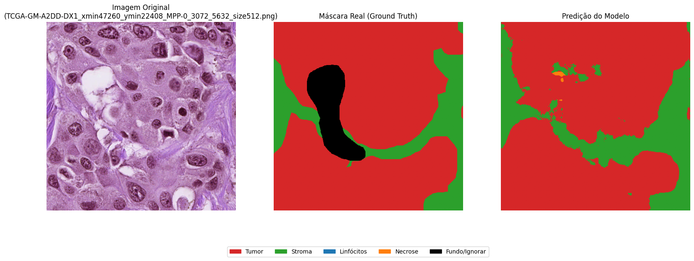

# Attention U-Net para Segmentação Semântica de Histopatologia

## Resumo

Este projeto implementa um pipeline de deep learning para segmentação semântica de imagens de histopatologia de câncer de mama. A arquitetura central é uma **Attention U-Net**, uma variação da U-Net que utiliza portões de atenção para focar em regiões relevantes da imagem, melhorando a precisão da segmentação.


## Conceito do Projeto

O fluxo de trabalho foi desenvolvido para realizar a segmentação multi-classe de tecidos em imagens histopatológicas.

1.  **Entrada**: Uma imagem de lâmina de histologia (512x512 pixels) é fornecida ao modelo.
2.  **Pré-processamento e Augmentation**: As imagens são normalizadas e um conjunto de técnicas de data augmentation (rotações, flips, ajustes de cor) é aplicado em tempo real para aumentar a robustez do modelo.
3.  **Processamento pelo Modelo**: A imagem passa pela rede Attention U-Net, que aprende a identificar e delinear diferentes tipos de tecido.
4.  **Saída**: O modelo gera uma máscara de segmentação, onde cada pixel é classificado em uma das seguintes categorias: **tumor**, **estroma**, **infiltrado linfocitário**, **necrose/detritos** ou uma classe especial **"ignorar"**.
5.  **Treinamento Otimizado**: Durante o treinamento, a função de perda ignora completamente os pixels da classe "ignorar" e aplica pesos maiores às classes minoritárias, forçando o modelo a aprender suas características de forma mais eficaz.

O fluxo de dados pode ser visualizado da seguinte forma: `[Imagem de Entrada] -> [Attention U-Net] -> [Máscara de Segmentação Prevista]`

## Exemplos de Resultados



## Características Técnicas

* **Modelo**: Implementação de uma Attention U-Net com blocos de codificador, decodificador e portões de atenção para refinar os skip-connections.
* **Função de Perda Híbrida**: Combinação de Focal Loss ponderada e Dice Loss para otimizar tanto a classificação de pixels difíceis quanto a sobreposição espacial das máscaras.
* **Ponderação de Classes**: Cálculo de pesos de classe baseado na frequência mediana para mitigar o desbalanceamento. O peso da classe "ignorar" é fixado em zero para excluí-la do aprendizado.
* **Data Augmentation**: Pipeline de aumento de dados em tempo de execução com `tf.data`, incluindo transformações geométricas e de cor.
* **Estrutura de Código Modular**: O projeto é organizado nos diretórios `data`, `model` e `utils` para fácil manutenção e extensibilidade.
* **Configuração Centralizada**: Todos os hiperparâmetros (taxa de aprendizado, tamanho do batch, épocas) e caminhos de arquivos são gerenciados em `config.py`.
* **Callbacks de Treinamento**: Utiliza `ModelCheckpoint`, `ReduceLROnPlateau`, `EarlyStopping` e `CSVLogger` para um treinamento robusto e monitorado.

## Estrutura do Projeto

```
├── config.py                   # Arquivo central de configuração do experimento
├── main.py                     # Ponto de entrada para execução do treinamento
├── requirements.txt            # Lista de dependências do projeto
├── data/
│   └── data_loader.py          # Módulo para carregamento e pré-processamento dos dados
├── model/
│   ├── unet.py                 # Implementação da arquitetura Attention U-Net
│   └── train.py                # Lógica do loop de treinamento e callbacks
└── utils/
    └── metrics.py              # Implementação das métricas (Dice, IoU) e funções de perda
```

## Instalação e Configuração

1.  **Clonar o Repositório:**
    ```bash
    git clone https://github.com/CassioLeodegario/att-u-net
    cd att-u-net
    ```

2.  **Criar um Ambiente Virtual (Recomendado):**
    ```bash
    python -m venv venv
    source venv/bin/activate  # No Windows: venv\Scripts\activate
    ```

3.  **Instalar Dependências:**
    ```bash
    pip install -r requirements.txt
    ```

4.  **Estrutura do Dataset:** O código espera que o caminho em `config.py` aponte para um diretório com a seguinte estrutura:
    ```
    <DATASET_PATH>/
    ├── train_512/
    │   ├── image_001.png
    │   └── ...
    ├── train_mask_512/
    │   ├── image_001.png
    │   └── ...
    ├── val_512/
    │   ├── image_101.png
    │   └── ...
    └── val_mask_512/
        ├── image_101.png
        └── ...
    ```

## Execução

1.  **Ajuste dos Parâmetros**
    * Abra o arquivo `config.py`.
    * **Ajuste o `DATASET_PATH` para o caminho onde seu dataset está localizado**.
    * Modifique outros hiperparâmetros como `BATCH_SIZE`, `EPOCHS` ou `LR` conforme necessário.

2.  **Iniciar o Treinamento**
    * Execute o script principal a partir da raiz do projeto:
        ```bash
        python main.py
        ```
    * O script irá configurar o ambiente, carregar os dados, construir o modelo e iniciar o treinamento. O progresso será exibido no console.
    * Ao final, o melhor modelo será salvo em `attention_unet_bcss.keras`, e os gráficos de treinamento serão salvos na pasta `results/`.

## Reprodução

* **Dataset Utilizado**: [Breast Cancer Semantic Segmantation (BCSS)](https://www.kaggle.com/datasets/whats2000/breast-cancer-semantic-segmentation-bcss/data)
* **Modelo Pré-Treinado (Attention U-Net)**: [Attention U-Net](https://drive.google.com/file/d/1gGok-SjnsmdiSahCd0hZMJLw6Vj0YBlB/view?usp=sharing)
* **Modelo Pré-Treinado (U-Net)**: [U-Net](https://drive.google.com/file/d/1pmpGlP2eOy8boNVqew9SaJIcmgduuBYJ/view?usp=sharing)